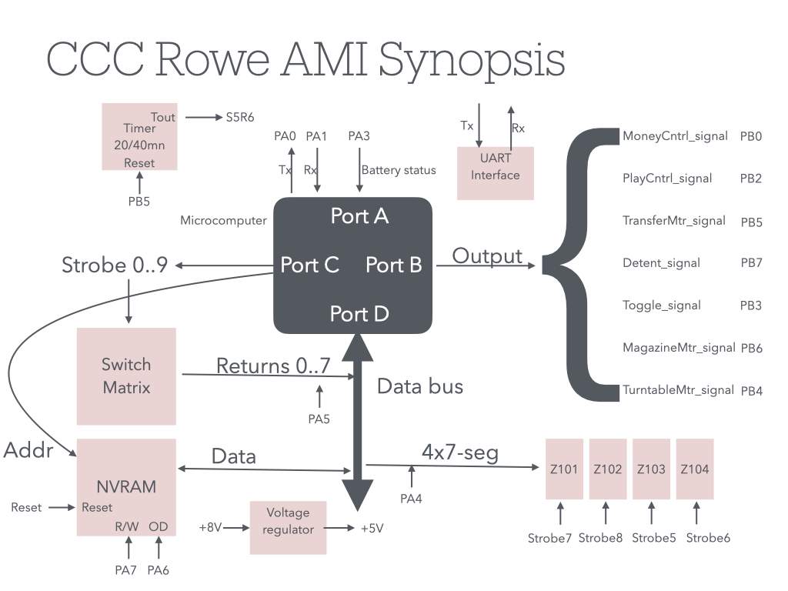
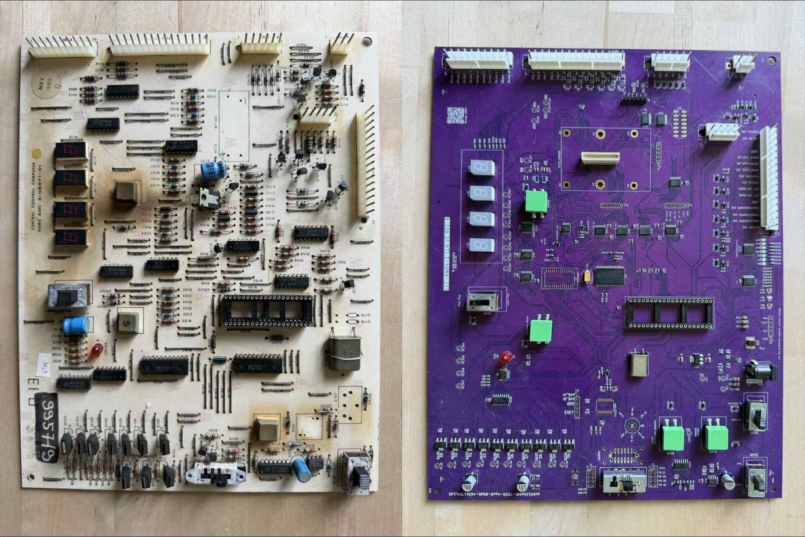

# rowe-brain
Clonage of  the CPU section of the CCC board 6-08871-01 (Jukeboxes ROWE AMI CTI-2 RI-3 R-84 R-85.)

## Context

The Central Control Computer (CCC) of the ROWE AMI CTI-2 RI-3, R84 R85 R86 R87 R88 jukeboxes is the "brain" of the jukebox.

As often on these 50-year-old systems, breakdowns appear more and more frequently, and they end up not being able to be repaired at all.

Hence the idea of making clones of these electronic board, using modern components as much as possible but with the constraint of having to respect the external logic of the signals to be able to replace the original boards with their clone in a pure spirit of plug&play.

## Objective

The objective of this project is the cloning of the ccc board 6-08871-01.

We have established 2 milestones:

- Redesign of the board itself.

- Cloning of the 40-pin microcontroller, with its program

## Variants of boards

The CCC board exists in 2 versions:

- 6-08871-01

- 6-08871-04

The 2 boards are interchangeable. However, the -01 hosts a Rockwell microcontroller based on 650x, while the -04 must be equipped with a MOSTEK 3870 microcontroller.

The differences are very well described in the document [r84ts_dl.pdf](r84ts_dl.pdf).

They both have 40 DIL pins, but their pin-out is different. Hence, you cannot fit a -01 with a MOSTEK, or vice-versa a -04 with a Rockwell one.

Since the first schematic we have had access to was the -01 (see rowe ami doc p.38), we decided to go cloning the -01. Besides, we are more accustomed to 6502 instruction set rather than to Mostek.

## Milestone 1: Redesign of the board
### Synopsis

### Result

## Milestone 2: Cloning of the microcontroller
### What is to be rewritten in VHDL
[Schematic of the original microcontroller](doc/schemas_rowe_ami_c 40.pdf)

### ROM Copy 
We have read the 2K bin code which resides in the 2316 of the R6500/alternate board. This board is made of :
- The CPU, which is a R6503 Rockwell device, clocked at 1MHz.
- A 6520 PIO
- A 6532 PIT
- A 2316 2K ROM

2316 is nothing else than a 2716, with 3 specific chip select pin logic, specified by the customer at fabrication time. But we are fortunate, because the pattern chosen by the customer here, is identical to the one of a normal 2716. Then, once the chip is delicately unsoldered, one just need to use a standard prom programer (Dataman mempro in my case) to read it. And that's it!    

You will find the result in the bin file in this repo.  

The txt file is the commented (work in perpetual progress) disassembled code. 

